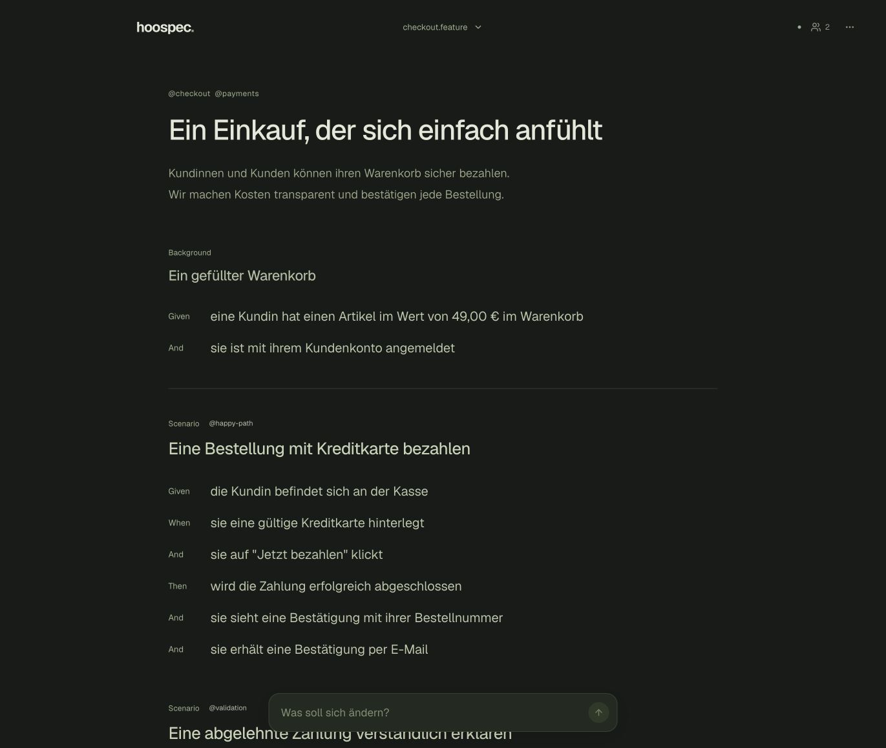

# Hoospec

A calm studio for reviewing Gherkin specifications and Architecture Decision Records together.

Hover a sentence or section, click it, describe the change, and let an AI agent update that exact selection. Double-click to edit directly. Changes save automatically; undo and redo are part of the workflow.



## Quick start

Use **Node.js 22.13+** (Node 24 recommended).

```sh
npm ci
npm run dev
```

Open **http://127.0.0.1:3410**. Sample specifications are included. Import your own `.feature`, ADR `.md` / `.markdown`, or exported Hoospec `.json` documents. Manual editing works without an AI provider.

## What you can do

- Review features, scenarios, steps, tables and doc strings with hierarchical hover outlines.
- Edit titles, descriptions, steps, table cells, ADR sections, individual questions and answers inline.
- Select a table or section and ask an agent to change it while preserving everything outside the selection.
- Browse specs and ADRs in a calm, searchable table overview.
- Manage open ADRs, answer questions, record decisions and set their lifecycle status explicitly.
- Store structured JSON as the source of truth and generate Gherkin / Markdown exports.
- Use light, dark or system theme, keyboard navigation and reduced-motion preferences.
- Work together through shared navigation, presence and live drafts in the Node server mode.

The interface currently uses German labels. [Editor shortcuts and workflow](docs/editor.md).

## Embed in an existing GitLab project

```sh
npm run install:gitlab -- /path/to/existing/project
```

Configure repository-relative document locations in `hoospec.config.json`: `paths.specs` for Gherkin files, `paths.adrs` for architecture decisions, and `paths.workspace` for canonical JSON. During GitLab CI, a config at the repository root takes precedence over the embedded config. Existing document paths are preserved. See [repository configuration](docs/gitlab.md#ablageorte-im-repository).

This copies Hoospec to `tools/hoospec/`. Add the provided CI include and attach step to your existing Pages job. Hoospec appears at `/hoospec/`, alongside the existing website, and edits the same repository.

**[Installation guide and complete CI example](docs/gitlab.md)**

- Public OAuth application with PKCE; normal users do not need a personal access token.
- Project membership is checked, and members without push permission get a read-only view.
- Collect edits locally, preview diffs and explicitly submit an atomic commit as a draft GitLab merge request. Team members can open the same draft and synchronize further changes. The target branch changes only when merged in GitLab.
- Local drafts are saved automatically in the browser and restored after reload in the same tab. OAuth tokens stay in memory. Shared work is stored on a draft branch and follows project CI rules.

**GitLab Pages access control protects the entire project's Pages website.** Set it to **Only project members**. Enabling access control on a self-hosted instance may require its operator. Hoospec's browser login alone does not make a public Pages site private.

## Connect an AI provider

The Node server supports an OpenAI-compatible streaming `/chat/completions` endpoint. Supply these **server-side** environment variables through your environment or secret manager:

```dotenv
HOOSPEC_AI_BASE_URL=https://your-provider.example/v1
HOOSPEC_AI_MODEL=your-model
HOOSPEC_AI_KEY=<server-only-key>
```

Restart the server after changing them. `.env.example` lists all supported settings. Keys never belong in `NEXT_PUBLIC_*` variables or the public Pages configuration.

HooLLM is supported. The optional `dev:hoollm` / `start:hoollm` helpers accept a key from `HOOSPEC_AI_KEY` or protected stdin and use `HOOSPEC_AI_MODEL`; they do not depend on a particular secret manager or local account.

Static GitLab Pages needs a separate agent bridge. [Bridge setup and boundaries](docs/gitlab.md#optional-ai).

## Run a production server

```sh
npm run build
npm start
```

The start script runs the Standalone server and serves its assets. It binds to `127.0.0.1:3410` by default. Override `HOOSPEC_PORT` and `HOOSPEC_HOST` as needed. `HOOSPEC_DATA_DIR` selects a persistent directory; the default is `.hoospec/` in the project root.

### Docker

```sh
docker pull ghcr.io/openhoo/hoospec:latest
docker run --rm --name hoospec \
  -p 127.0.0.1:3410:3000 \
  -v hoospec-data:/data/hoospec \
  ghcr.io/openhoo/hoospec:latest
```

Images are published to `ghcr.io/openhoo/hoospec` after all CI checks and the container persistence test pass on `main`. Use `latest` for the most recent verified main build, or `sha-<full-commit-sha>` to pin a specific revision. The published image currently targets Linux amd64. To build locally instead, run `docker build -t hoospec:local .`.

The container runs as a non-root user. Use a named volume for persistence; existing bind mounts must be writable by the container's `node` user. Inject AI variables at runtime. The build downloads dependencies and the Geist fonts, so it requires network access.

**The Node server is a shared trusted-workspace service, without built-in user authentication.** Keep it on loopback or behind an authenticated reverse proxy. It supports one process per data directory; multiple replicas require a different transactional store. The GitLab Pages adapter uses GitLab's own identity and repository permissions instead.

## Verify

```sh
npm run check
npm run build
npm run test:integration
HOOSPEC_PAGES_PATH=hoospec npm run build:pages
HOOSPEC_PAGES_PATH=hoospec npm run test:pages
docker build -t hoospec:test .
npm run test:container -- hoospec:test
```

Unit and server integration tests use isolated fixtures and no real AI credentials. GitHub Actions checks Node 22 and 24, server integration, a nested static export and container persistence. [Testing guide](docs/testing.md) explains the optional test against a disposable GitLab instance.

## Architecture

Next.js App Router, React, TypeScript, Tailwind and shadcn/ui with Base UI. Cucumber's Gherkin AST provides source selections and validation. ADR Markdown uses validated sections and list-item ranges.

`src/lib/json-document.ts` defines structured documents and generators. `src/lib/workspace-actions.ts` implements versioned mutations shared by the server and GitLab adapters. `src/lib/store.ts` handles local persistence; `src/lib/gitlab-backend.ts` handles repository transactions. The editor lives in `src/components/studio.tsx`.

Changes are validated before persistence. Stale edits and incomplete AI streams cannot overwrite newer content. Histories include up to 50 undo/redo states and the last 100 changes. Legacy text workspaces migrate with a preserved backup. Pages polls a shared MR branch, preserves conflicting local drafts and commits only on explicit submission/synchronization. Unsynchronized Pages drafts are automatically stored per browser tab and restored after reload and authorization. Conflict resolution is explicit; shared work is persisted on MR branches. Shared presence and live unsaved input belong to server mode.

[Contributing](CONTRIBUTING.md) · [Security and deployment boundaries](SECURITY.md) · [Changelog](CHANGELOG.md)

## License

[Apache-2.0](LICENSE). See [NOTICE](NOTICE) and [third-party notices](THIRD_PARTY_NOTICES.md).
